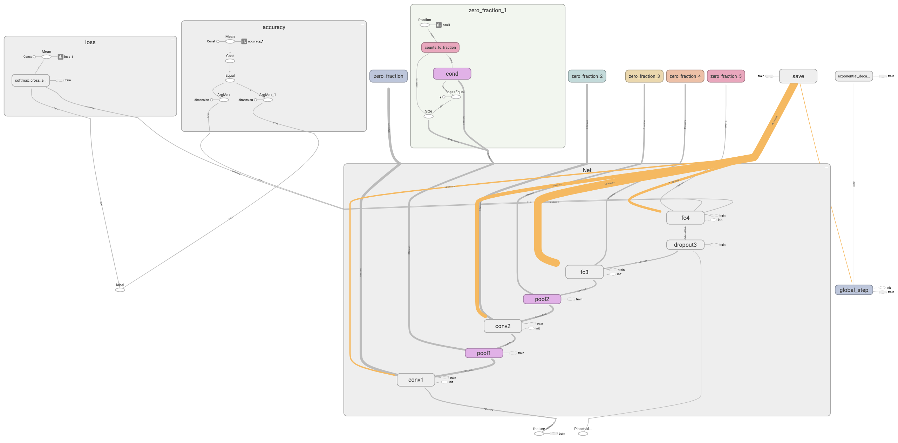

# **Machine Learning Cookbooks**
[](https://github.com/ellerbrock/open-source-badge/)
[](https://img.shields.io/badge/Python-r3.6-yellowgreen.svg)
[](https://img.shields.io/static/v1.svg?label=TensorFlow&message=r1.13&color=brightgreen)
[](https://img.shields.io/static/v1.svg?label=License&message=MIT&color=blue)
[](https://img.shields.io/static/v1.svg?label=Experience&message=enjoyful&color=red)

- [Machine Learning Cookbooks](#play-with-tensorflow)
  - [Motivation](#motivation)
  - [Quick Start](#quick-start)
    - [Environment Setup](#environment-setup)
    - [What are Included](#what-are-included)
  - [Structural Procedures of Using TensorFlow (based on CNN)](#structural-procedures-of-using-tensorflow-based-on-cnn)
    - [Step 1: define necessary flags](#step-1-define-necessary-flags)
    - [Step 2: prepare train, evaluation and test data](#step-2-prepare-train-evaluation-and-test-data)
    - [Step 3: define operations and tensors, and store them in a data flow graph](#step-3-define-operations-and-tensors-and-store-them-in-a-data-flow-graph)
    - [Step 4: define summaries and merge them](#step-4-define-summaries-and-merge-them)
    - [Step 5: run the session (initialize --> train --> evaluate)](#step-5-run-the-session-initialize----train----evaluate)
    - [Step 6: Analyze the results](#step-6-analyze-the-results)
  - [Federated Learning](#federated-learning)
  - [Tips](#tips)
  - [Final Notes](#final-notes)
    - [Author](#author)
    - [Reference](#reference)
    - [Acknowledgement](#acknowledgement)
    - [License](#license)

## **Motivation**
We can not deny that there has already existed *a mass of* open-source courses and tutorials on TensorFlow. However, not many of them are 
**simple** and **ready-to-use**. This repository aims to provide an easy and fun-filled tutorial on that how to use TensorFlow to train 
and test Machine Learning models with several structural procedures.

Documentation and **elaborate** code annotation are provided. Hope you can enjoy it!

## **Quick Start**
### **Environment Setup**
Codes of this repository is based on **Python 3.6** and **TensorFlow r1.13**. For Python installation, please refer to 
[Python download page](https://www.python.org/downloads/). For TensorFlow installation, please refer to 
[TensorFlow installation page](https://www.tensorflow.org/install). If you want to build TensorFlow *from source* to maximize the CPU and 
GPU resource utilization of your computer, please refer to [build from source](https://www.tensorflow.org/install/source).

### **What are Included**
The home directories are **dataset**, **figures** and **src**. 

+ Directory **dataset** contains two representative datasets, `MNIST` and `fire_theft.xls`.
  + The MNIST database of handwritten digits, available from [this page](http://yann.lecun.com/exdb/mnist/), has a training set of 60,000 
    examples, and a test set of 10,000 examples. It is a subset of a larger set available from NIST. The digits have been size-normalized 
    and centered in a fixed-size image. The **compressed** files are
    ```Go
    train-images-idx3-ubyte.gz:  training set images (9912422 bytes) 
    train-labels-idx1-ubyte.gz:  training set labels (28881 bytes) 
    t10k-images-idx3-ubyte.gz:   test set images (1648877 bytes) 
    t10k-labels-idx1-ubyte.gz:   test set labels (4542 bytes)
    ```
    Below is an example of these handwritten digits.

    

    The files in directory **unpacked** are the unpacked version of the above four files.
  + `fire_theft.xls` is used for Linear Regression where each sample has a one-dimension feature and a continuous label.

+ Directory **figures** contains (i) the diagrams of training and testing results, (ii) graphs from TensorBoard and (iii) various sketch maps. 
  Below is an diagram of SVM training results.

  

+ Directory **src** contains several Python packages. **Module installation will be added in future.**
  * **Start up**: A warm up on TensorFlow.
  * **Statistical Machine Learning models**: Regressions (Linear Regression, Logistic Regression, LASSO) and Support Vector Machines (SVM), etc. 
    *We refer to [**PRML**](http://users.isr.ist.utl.pt/~wurmd/Livros/school/Bishop%20-%20Pattern%20Recognition%20And%20Machine%20Learning%20-%20Springer%20%202006.pdf) 
    to study **basic concepts** and **mathematical theories** for Statistical Learning.*
  * **Deep Learning models**: Perceptrons, Convolutional Neural Networks, Recurrent Neural Networks and Deep Q-Network, etc. 
    *We refer to [**Deep Learning**](https://github.com/janishar/mit-deep-learning-book-pdf/blob/master/complete-book-pdf/deeplearningbook.pdf) to study 
    **basic concepts** and **mathematical theories** for Deep Learning.*
  * **Federated Learning frameworks**: Use cases and customized algorithms based on research from Google: *[**Federated Learning**](https://arxiv.org/abs/1610.05492)*.
  * **utils**: This is a package containing utility functions, such as ``load_mnist(...)``, ``global_settings(...)``, ``plot_progress_bar(...)`` and so on.

## **Structural Procedures of Using TensorFlow (based on CNN)**
### **Step 1: define necessary flags**
* ***Define flags on recording 'trained models' and 'event logs'.*** 
  Models can be stored in directory **checkpoints**, and event logs can be stored in directory **logs** of current path. The corresponding Python code is:
  ```Python
  import tensorflow as tf
  import os
  tf.flags.DEFINE_string('log_dir', os.path.dirname(os.path.abspath(__file__)) + '/logs', 'Directory where event logs are written to.')
  tf.flags.DEFINE_string('checkpoint_dir', os.path.dirname(os.path.abspath(__file__)) + '/checkpoints', 'Directory where checkpoints are written to.')
  tf.flags.DEFINE_integer('max_num_checkpoints', 10, 'Maximum number of checkpoints kept.')
  ```
* ***Define flags on recording necessary learning parameters, such as batch size, step numbers, initial learning rate and decay frequency.*** 
  The data type is ``float`` or ``integer``. Please refer to the recommanded books about **how to set the value of those parameters**. Typical Python code is:
  ```Python
  import tensorflow as tf
  tf.flags.DEFINE_integer('batch_size', 512, 'Number of samples per batch.')
  tf.flags.DEFINE_integer('num_epochs', 2, 'Number of epochs for training.')
  tf.flags.DEFINE_float('initial_learning_rate', 0.001, 'The initial learning rate for optimization.')
  tf.flags.DEFINE_float('decay_factor', 0.95, 'The decay factor of learning rate.')
  tf.flags.DEFINE_integer('num_classes', 10, 'The default number of classes of MNIST dataset.')
  tf.flags.DEFINE_integer('num_epochs_per_decay', 1, 'The number of epochs passed to decay learning rate.')
  ```
* ***Define status flags.*** 
  Status flags guide us on the status of current process, such as "is on training", "is on testing", etc. Typical status flags are defined below:
  ```Python
  import tensorflow as tf
  tf.flags.DEFINE_boolean('is_evaluation', True, 'Whether or not the model should be evaluated.')
  tf.flags.DEFINE_boolean('is_training', False, 'Training or testing.')
  tf.flags.DEFINE_boolean('is_validating', True, 'Online test (validate) is allowed or not.')
  tf.flags.DEFINE_boolean('fine_tuned', False, 'Fine tuning is desired or not.')
  tf.flags.DEFINE_boolean('allow_soft_placement', True,
                          'Automatically put the variables on CPU if there is no GPU support.')
  tf.flags.DEFINE_boolean('log_device_placement', False,
                          'Demonstrate that which variables are on which devices.')
  ```
  All defined flags are stored in ``tf.flags.FLAGS``. We can use ``FLAGS = tf.flags.FLAGS`` to simplify the code.

### **Step 2: prepare train, evaluation and test data**
* ***Read data from csv, xlsx, txt or other kinds of files.*** 
  TensorFlow integrates some typical and classic datasets in ``tensorflow.examples.tutorials``. Here we take MNIST as an example.
  ```Python
  from tensorflow.examples.tutorials.mnist import input_data
  mnist = input_data.read_data_sets('../../../dataset/MNIST/compressed', reshape=False, one_hot=False)
  ```
  In the above code, string ``'../../../dataset/MNIST/compressed'`` is the relative position where the MNIST data stores. The already divided train, 
  validation and test datasets can be refered by ``mnist.train.images``, ``mnist.train.labels``, ``mnist.validation.images``, ``mnist.validation.labels``, 
  ``mnist.test.images`` and ``mnist.test.labels``, respectively. Take ``mnist.train.images`` as an example, it is an numpy array with shape 
  ``[num_samples=55000, rows=28, columns=28, color_depth=1]``. Actually, the function is going to be deprecated. TensorFlow recommands to use 
  ``tf.keras.datasets.mnist.load_data(path='mnist.npz')`` to load MNIST. The parameter is the path where to cache the dataset locally (relative to 
  ``~/.keras/datasets`` for macOS and Linux). The returns are tuples of numpy arrays: ``(x_train, y_train), (x_test, y_test)``. Besides, we can rewrite 
  our own data structures to customize certain features. A typical data structure is defined as follows.
  ```Python
  import numpy as np
  class Data(object):
      def __init__(self, images, labels, num_classes=10, one_hot=False, need_normalize=True, reshape=False):
          """
          Initialization.

          :param images: the image samples (numpy array) with shape [num_samples, rows, columns, color_depth]
          :param labels: the label of samples (numpy array) with shape [num_samples]
          :param num_classes: the number of classes/labels
          :param one_hot: whether one hot coding is used
          :param need_normalize: whether normalization is needed ([0, 255] -> [0., 1.]
          :param reshape: whether reshape the features of image into one-dimension vector
          """
          assert num_classes != 0, 'Number of classes can not be zero!'
          assert images.shape[0] == labels.shape[0], 'Number of images is not the same with number of labels!'
          self.__num_samples = images.shape[0]

          if reshape:
              assert images.shape[3] == 1, 'Currently we do not handle images whose depth > 1!'
              images = images.reshape(images.shape[0], images.shape[1] * images.shape[2])
          
          if need_normalize:
              images = images / 255.0
          # deep copy is not needed
          self.__images = images
          
          if one_hot:
              indices = np.arange(self.__num_samples) * num_classes
              one_hot_labels = np.zeros([self.__num_samples, num_classes])
              one_hot_labels.flat[indices + labels.ravel()] = 1
              self.__labels = one_hot_labels
          else:
              self.__labels = labels

      @property
      def images(self):
          return self.__images
      
      @property
      def labels(self):
          return self.__labels
      
      @property
      def num_samples(self):
          return self.__num_samples
  ```
  With the help of the above class ``Data``, we can obtain our own data structure as follows.
  ```Python
  import collections
  train = Data(mnist.train.images, mnist.train.labels, num_classes=10, one_hot=True, need_normalize=True, reshape=False)
  validation = Data(mnist.validation.images, mnist.validation.labels, num_classes=10, one_hot=True, need_normalize=True, reshape=False)
  test = Data(mnist.test.images, mnist.test.labels, num_classes=10, one_hot=True, need_normalize=True, reshape=False)
  data_collections = collections.namedtuple('data_collections', ['train', 'validation', 'test'])
  data = data_collections(train=train, validation=validation, test=test)
  ```
* ***Read basic information on each dimension of train data.*** 
  For MNIST, ``train_num_samples = 55000``, ``height = 28``, ``width = 28``, ``depth = 1``. We care about the number of samples in train and test 
  set because we need them to decide the number of epochs, batches, etc.
  ```Python
  train_info = data.train.images.shape
  train_num_samples = train_info[0]
  height = train_info[1]
  width = train_info[2]
  depth = train_info[3]
  ```

### **Step 3: define operations and tensors, and store them in a data flow graph**
* ***Define graph.*** 
  TensorFlow computation is described by a dataflow graph, it contains a set of ``tf.Operation`` objects, which represent units of computation; 
  and ``tf.Tensor`` objects, which represent the units of data that flow between operations. A typical usage involves the ``tf.Graph.as_default`` 
  context manager, which overrides the current default graph for the lifetime of the context. As a result, the code structure is 
  ```Python
  import tensorflow as tf
  graph = tf.Graph()
  with graph.as_default():
      # define tensors, including constants, variables, placeholders and operations
  ```
* ***Define tensors.*** 
  Usually, the need-to-be-defined tensors including **constants**, **variables** and **placeholders**, which can be defined by ``tf.constant(value, name)``, 
  ``tf.Variable(initial_value, name, trainable)``, and ``tf.placeholder(dtype, shape, name)``, respectively. ``tf.placeholder`` inserts a placeholder 
  for a tensor that will be always fed by ``feed_dict``. Besides, **operations** are tensors, too. But their definitions are multitudinous.

  ***(i)*** Typical **variables** including ``global_step`` and ``learning_rate``. Corresponding code is
  ```Python
  import tensorflow as tf
  global_step = tf.Variable(initial_value=0, name='global_step', trainable=False)
  learning_rate = tf.train.exponential_decay(
      FLAGS.initial_learning_rate,
      global_step=global_step,
      decay_steps=int(train_num_samples / FLAGS.batch_size * FLAGS.num_epochs_per_decay),
      decay_rate=FLAGS.decay_factor,
      staircase=True,
      name='exponential_decay_learning_rate')
  ```
  ``global_step`` is a TensorFlow variable increasing automatically at each training step. ``tf.train.exponential_decay`` applies an exponential decay 
  function to a provided initial learning rate. It requires the ``global_step`` to compute the decayed learning rate. The decayed learning rate $r'$ 
  is calculated by 
  $$
  r' = r \cdot d^{\frac{gs}{ds}},
  $$
  where $r$ is the initial learning rate, $d$ is ``decay_rate``, $gs$ is the global steps, and $ds$ is ``decay_steps``. If the argument ``staircase`` is 
  True, then $\frac{gs}{ds}$ is an integer division and the decayed learning rate follows a staircase function.

  ***(ii)*** Typical **placeholders** are features and corresponding labels of dataset (usually in batch mode). The definitions are:
  ```Python
  import tensorflow as tf
  feature_place = tf.placeholder(tf.float32, shape=([None, height, width, depth]), name='feature')
  label_place = tf.placeholder(tf.float32, shape=([None, FLAGS.num_classes]), name='label')
  dropout_param = tf.placeholder(tf.float32)
  ```
  We recommand you to use ``image_place`` or ``feature_place`` as the name of the placeholder for image classification task. ``dropout_param`` is the 
  dropout rate of input units, which helps prevent overfitting.

  ***(iii)*** Typical **operations** including the creation of *output logits* (can be understood as the output layer), the calculation of the corresponding 
  *loss* and *accuracy*, and the *optimizer* that applies the specific (stochastic or batch) gradient descent methods. The output logits and end points are 
  calculated by the chosen models. Take a Fully-connected Convolutional Neural Network (CNN) for image classification as an example, we first create layers 
  (input layer, hidden layers, and output layer), and then calculate the loss and accuracy based on the output layer. 

  Before that, We can use ``tf.contrib.framework.arg_scope(list_ops_or_scope, **kwargs)`` to **store the default arguments for the given set of list_ops**, 
  which can simplify the code on parameter setting. The first parameter is the given set of ``list_ops`` or ``scopes``, and the following parameters are 
  the default settings with shape ``arg=value``. It return a dictionary of ``{op: {arg: value}}``. A typical setting for Fully-connected CNN is 
  ```Python
  import tensorflow as tf
  def create_default_args(weight_decay=0.0005, is_training=False):
    """
    Define the default network arguments for the given set of list_ops.

    :param weight_decay: the decay rate of weight
    :param is_training: indicate that training or not in dropout layer
    :return: the scope of the net
    """
    if is_training:
        with tf.contrib.framework.arg_scope(
                [tf.contrib.layers.conv2d],
                padding='SAME',
                weights_regularizer=tf.contrib.slim.l2_regularizer(weight_decay),
                weights_initializer=tf.contrib.layers.variance_scaling_initializer(
                    factor=1.0,
                    mode='FAN_AVG',
                    uniform=False,
                    seed=None,
                    dtype=tf.float32),
                activation_fn=tf.nn.relu) as sc:
            return sc
    else:
        with tf.contrib.framework.arg_scope(
                [tf.contrib.layers.conv2d],
                padding='SAME',
                activation_fn=tf.nn.relu) as sc:
            return sc
  ```
  Apperantly, the above code only defines the default parameter for ``tf.contrib.layers.conv2d``. The details on what ``padding='SAME'`` and other parameters mean 
  will not be elaborated. We recommand you to consult [tf.contrib.layers.conv2d](https://www.tensorflow.org/api_docs/python/tf/contrib/layers/conv2d). 

  Now we create a Fully-connected CNN with five layers. Standard code is as follows:
  ```Python
  import tensorflow as tf
  def create_net(images, num_classes=10, is_training=False, keep_prob=0.5, squeeze=True, scope='Net'):
    """
    Construct a Fully-connected Convolutional Neural Network.

    :param images: the input images
    :param num_classes: the number of classes
    :param is_training: indicate that training or not in dropout layer
    :param keep_prob: the keep probability of dropout layer
    :param squeeze: whether squeeze or not
    :param scope: the scope name for context manager of variables
    :return: the created network
    """
    with tf.variable_scope(scope, default_name='Net', values=[images, num_classes]) as sc:
        end_points_collection = sc.name + '_end_points'
        with tf.contrib.framework.arg_scope([tf.contrib.layers.conv2d, tf.contrib.layers.max_pool2d],
                                            outputs_collections=end_points_collection):
            # hidden layer 1
            net = tf.contrib.layers.conv2d(images, 32, [5, 5], scope='conv1')
            net = tf.contrib.layers.max_pool2d(net, [2, 2], 2, scope='pool1')

            # hidden layer 2
            net = tf.contrib.layers.conv2d(net, 64, [5, 5], scope='conv2')
            net = tf.contrib.layers.max_pool2d(net, [2, 2], 2, scope='pool2')

            # hidden layer 3
            net = tf.contrib.layers.conv2d(net, 1024, [7, 7], padding='VALID', scope='fc3')
            net = tf.contrib.layers.dropout(net, keep_prob, is_training=is_training, scope='dropout3')

            # output layer
            logits = tf.contrib.layers.conv2d(net, num_classes, [1, 1], activation_fn=None, scope='fc4')

            # return the collections as a dict
            end_points = tf.contrib.slim.utils.convert_collection_to_dict(end_points_collection)

            # squeeze the output layer logits spatially to eliminate extra dimensions
            if squeeze:
                logits = tf.squeeze(logits, [1, 2], name='fc4/squeezed')
                end_points[sc.name + '/fc4'] = logits
            return logits, end_points
  ```
  ``tf.variable_scope(scope, deafult_name, value)`` returns a context manager for defining ops that creates variables (layers). Variable scope allows us to create 
  new variables and to share already created ones while providing checks to not create or share by accident. The third parameter ``values`` is the list of tensor 
  arguments that are passed to the op function. What we put into ``values`` are ``images`` and ``num_classes``, which are *the input* of the first layer and 
  *the output size* of the last layer, respectively. (TODO: add descriptions on ``end_points``.) The typical layers in CNN are **convolutional layer** and **pooling layer**. 
  Please consult official APIs and recommanded books on details. Besides, ``tf.contrib.layers.dropout`` applies **dropout** to the input ``net``. At last, ``tf.squeeze`` 
  returns a tensor of the same type with the chosen dimensions of size 1 removed (in the above code, the chosen dimensions are 1 and 2). 

  By the visualization tools from TensorBoard, the constructed model looks like:

  

  Details on **Net** is demonstrated below:

  

  With the above functions defined, we can use the following code to construct the model:
  ```Python
  arg_scope = create_default_args(weight_decay=0.0005, is_training=FLAGS.is_training)
  with tf.contrib.framework.arg_scope(arg_scope):
      logits, end_points = create_net(
          image_place,
          num_classes=FLAGS.num_classes,
          is_training=FLAGS.is_training,
          keep_prob=dropout_param)
  ```
    
  Now it's time to define the calculating operations of loss and accuracy. Without loss of generality, we computes **softmax cross entropy** between ``logits`` and ``labels``. 
  The corresponding accuracy can be calculated by comparing the differences between them, too. The code is as follows.
  ```Python
  import tensorflow as tf
  # the calculating operation of loss
  with tf.name_scope('loss'):
      loss = tf.reduce_mean(tf.nn.softmax_cross_entropy_with_logits(logits=logits, labels=label_place))
  # the calculating operation of accuracy
  with tf.name_scope('accuracy'):
      accuracy = tf.reduce_mean(tf.cast(tf.equal(
          tf.argmax(logits, 1),
          tf.argmax(label_place, 1)
      ), tf.float32))
  ```
  In the above code, We use ``tf.name_scope`` to push new scopes into the current graph.

    Next, we define the optimizer. Typical code is as follows.
  ```Python
  import tensorflow as tf
  # the train operation with a optimizer, which is an operation applying specific gradient methods
    optimizer = tf.train.AdamOptimizer(learning_rate=learning_rate)
    with tf.name_scope('train'):
        grads_and_vars = optimizer.compute_gradients(loss)
        train_op = optimizer.apply_gradients(grads_and_vars=grads_and_vars, global_step=global_step)
  ```

### **Step 4: define summaries and merge them**
``tf.summary`` is a module contains several functions who outputs summary protocol buffers with histograms, images, scalars or text. With the ``tf.summary.merge_all(...)`` 
method, all defined summaries are collected into the default graph.
* ***Output summary protocol buffers.*** 
  We use ``tf.summary.image(...)`` to create a summary protocol buffer with **images**. It returns a scalar tensor of type ``string``, which represents 
  the serialized summary protocol buffer. We use ``tf.summary.histogram(...)`` to create a summary protocol buffer with **histograms**. The return is also 
  a ``string``. We have ``tf.sumamry.scalar(...)``, too. Typical code for creating sumamries is as follows.
  ```Python
  import numpy as np
  # add three randomly chosen images from training set into summaries
  chosen_indices = np.random.randint(data.train.images.shape[0], size=(3,))
  tf.summary.image('images', data.train.images[chosen_indices], max_outputs=3, collections=['train_epoch'])
  ```
  Visualization of the summary protocol buffer with three images is demonstrated below.

  

* ***Merge created summary protocols into the default graph.*** 
  The input parameter is the strings in collections, including ``'train'``, ``'test'`` and ``'train_epoch'``.
  ```Python
  import tensorflow as tf
  # merge summaries
  train_summary_op = tf.summary.merge_all('train')
  validate_summary_op = tf.summary.merge_all('validate')
  train_summary_op_epoch = tf.summary.merge_all('train_epoch')
  ```

### **Step 5: run the session (initialize --> train --> evaluate)**
* ***Make preparations.*** 
  In order to generalize the code, we need do some extra works (this part may not need in your code). First we need collect all the ready-to-use tensors 
  into a dictionary, including **operations**, **placeholders** and **serialized summary protocl buffers**. The variables and optimizer may not needed 
  (except ``global_step``) becuase they already been used on the creation of other tensors. The corresponding code is 
  ```Python
  # collect tensors into dict
  tensor_keys = ['cost', 'accuracy', 'train_op', 'global_step',                        # operations
                 'feature_place', 'label_place', 'dropout_param',                      # placeholders
                 'train_summary_op', 'validate_summary_op', 'train_summary_op_epoch']  # serialized summary buffers
  tensor_values = [loss, accuracy, train_op, global_step,
                   feature_place, label_place, dropout_param,
                   train_summary_op, validate_summary_op, train_summary_op_epoch]
  tensors = dict(zip(tensor_keys, tensor_values))
  ```
  What is ``tf.Session``? Actually, *a Session object encapsulates the environment in which Operation objects are executed, and Tensor objects are evaluated.*
  We need to configurate the creation of the **session**. The ``ConfigProto`` protocol buffer exposes various configuration options for a session. 
  For example, to create a session that uses soft constraints for device placement, and log the resulting placement decisions. Finally, let us start the session.
  ```Python
  config = tf.ConfigProto(
      allow_soft_placement=FLAGS.allow_soft_placement,
      log_device_placement=FLAGS.log_device_placement)
  sess = tf.Session(graph=graph, config=config)
  ```
* ***Run the session.*** 
  The most important method of ``tf.Session`` is ``run(fetches, feed_dict=None, options=None, run_metadata=None)``. This method runs one 
  "step" of TensorFlow computation, by running the necessary graph fragment to execute every ``Operation`` and evaluate every ``Tensor`` in ``fetches``, substituting 
  the values in feed_dict for the corresponding input values. The ``fetches`` argument may be a single graph element, or an arbitrarily nested list, tuple, 
  namedtuple, dict, or OrderedDict containing graph elements at its leaves. *The value returned by run() has the same shape as the fetches argument, where the 
  leaves are replaced by the corresponding values returned by TensorFlow.*

  What we need to do for running a session? We first initialize all the defined tensors, and then run the train and evaluation operation in this session. ***Here we can 
  say that the definition (or creation) of tensors and its initilization are not the same. The former just **describes** an action, but the latter **executes** the 
  action.*** The execution is bound with ``sess.run(...)`` method. 
  * ***Initialize all the defined tensors***. 
    ``tf.global_variables_initializer()`` create an operation that initializes global variables in the default graph. Do not forget 
    to put the operaiton into ``sess.run(...)``.
  * ***Train the model.*** 
    In order to generalize the code, we create a module named ``transaction.py``, where the train and test functions were defined. In the train function, 
    we first need to define summary writters with ``tf.summary.FileWriter``. The FileWriter class provides a mechanism to create an event file in a given directory and add 
    summaries and events to it. The class updates the file contents asynchronously. This allows a training program to call methods to add data to the file directly from the 
    training loop, without slowing down training. Typically, constructing a file writer creates a new event file in logdir. This event file will contain Event protocol buffers 
    constructed when we call one of the following functions: ``add_summary()``, ``add_session_log()``, ``add_event()``, or ``add_graph()``. What we pass into the file writer is 
    current graph: ``sess.graph``. The code looks like:
    ```Python
    # [step 5.2.1: define the summary writers for train and evaluate]
    train_summary_dir = os.path.join(keywords['log_dir'], 'summaries', 'train')
    train_summary_writer = tf.summary.FileWriter(train_summary_dir)
    train_summary_writer.add_graph(keywords['sess'].graph)

    validate_summary_dir = os.path.join(keywords['log_dir'], 'summaries', 'validate')
    validate_summary_writer = tf.summary.FileWriter(validate_summary_dir)
    validate_summary_writer.add_graph(keywords['sess'].graph)
    ```
    In the above code, ``keywords['log_dir']`` is an element from the dictionary ``keywords``, which is the input parameter for the train function. We write the code in this way because 
    we want to generalize the code. For now, we can loop the training process over the epochs. During each epoch, we (i) calculate the number of batches in this epoch, and then (ii) 
    in each batch, we obtain train and test data. With current batch data, we (iii) run back-propagation optimization based on SGD algorithms. ``feed_dict`` is a dictionary where relavant 
    placeholders and their values store. After that, we (iv) write the optimization summary of this batch into train summary writers, and (v) plot progress bar of (the rate of up-to-now 
    trained batches to all batches). Finally, at the end of this epoch, we (vi) write the training summary of the epoch into summary writters. Typical code is as follows.
    ```Python
    for epoch_idx in range(keywords['num_epochs']):
        train_num_batches = int(keywords['data'].train.images.shape[0] / keywords['batch_size'])
        # (1) go through each batch
        for batch_idx in range(train_num_batches):
            # (2) obtain the training data and label for current batch
            start_idx = batch_idx * keywords['batch_size']
            end_idx = (batch_idx + 1) * keywords['batch_size']
            train_feature_batch = keywords['data'].train.images[start_idx:end_idx]
            train_label_batch = keywords['data'].train.labels[start_idx:end_idx]

            # (3) run back-propagation optimization based on SGD algorithms
            train_loss_batch, _, train_summaries_batch, train_step = keywords['sess'].run(
                [keywords['tensors']['cost'],
                  keywords['tensors']['train_op'],
                  keywords['tensors']['train_summary_op'],
                  keywords['tensors']['global_step']],
                feed_dict={keywords['tensors']['feature_place']: train_feature_batch,
                            keywords['tensors']['label_place']: train_label_batch,
                            keywords['tensors']['dropout_param']: 0.5})

            # (4) write the optimization summary of this batch into train summary writers
            train_summary_writer.add_summary(train_summaries_batch, global_step=train_step)

            # (5) plot progress bar of (the rate of up-to-now trained batches to all batches)
            progress = float(batch_idx + 1) / train_num_batches
            plot_progress_bar(progress=progress, num_epochs=epoch_idx + 1, loss_batch=train_loss_batch)

        # (6) write the training summary of this epoch into writers
        train_summary_op_epoch = keywords['tensors']['train_summary_op_epoch']
        train_summaries_epoch = keywords['sess'].run(
            train_summary_op_epoch,
            feed_dict={keywords['tensors']['feature_place']: train_feature_batch,
                        keywords['tensors']['label_place']: train_label_batch,
                        keywords['tensors']['dropout_param']: 1.})
        train_summary_writer.add_summary(train_summaries_epoch, global_step=train_step)
    ```
    The train process is visualized as:

    

  * ***Validate the model.***
    After training process during one epoch, we ought to validate current model. The code does not have significant difference from the training process, as shown below.
    ```Python
    if keywords['is_validating']:
    print('Validating...')
    validate_accuracy_epoch, validate_summaries_epoch = keywords['sess'].run(
        [keywords['tensors']['accuracy'], keywords['tensors']['validate_summary_op']],
        feed_dict={keywords['tensors']['feature_place']: keywords['data'].validation.images,
                    keywords['tensors']['label_place']: keywords['data'].validation.labels,
                    keywords['tensors']['dropout_param']: 1.})
    print('Epoch ' + str(epoch_idx + 1) + ', validate accuracy = ' + '{:.5f}'.format(validate_accuracy_epoch))

    # write the validating summary of this epoch into writers
    current_step = tf.train.global_step(keywords['sess'], keywords['tensors']['global_step'])
    validate_summary_writer.add_summary(validate_summaries_epoch, global_step=current_step)
    ```
  
  * ***Save current model into checkpoints.***
    With the help of current running TensorFlow ``saver``, we save the model into ``checkpoint_dir``. Typical code is as follows.
    ```Python
    # [step 5.2.4: save current model into checkpoint directory
    model_saved_name = keywords['saver'].save(
        keywords['sess'], os.path.join(keywords['checkpoint_dir'], checkpoint_prefix))
    print('Model saved in: %s' % model_saved_name)
    ```

  * ***Test the model.***
    The testing process is not different from the training process. Do as the code below shown.
    ```Python
    def test(**keywords):
        """
        The general test function.

            :param keywords:
            -> :param sess: current running TensorFlow session
            -> :param saver: current running TensorFlow saver
            -> :param tensors: a dict stored used tensors, including:
                -> accuracy: the tensor (operation) who records the calculation of accuracy
                -> feature_place: the placeholder where images stored
                -> label_place: the placeholder where label stored
                -> dropout_param: the placeholder where dropout parameter stored
            -> :param checkpoint_dir: the checkpoint directory where fine-tuned model stored
            -> :param batch_size: the size (number of samples) of each batch
        :return: no return
        """
        checkpoint_prefix = 'model'
        keywords['saver'].restore(keywords['sess'], os.path.join(keywords['checkpoint_dir'], checkpoint_prefix))
        print('Restore the fine-tuned model for test...')
        print('Testing...')
        test_num_batches = int(keywords['data'].test.images.shape[0] / keywords['batch_size'])
        test_accuracy = 0
        for batch_idx in range(test_num_batches):
            # obtain the testing data and label for current batch
            start_idx = batch_idx * keywords['batch_size']
            end_idx = (batch_idx + 1) * keywords['batch_size']
            test_feature_batch = keywords['data'].test.images[start_idx:end_idx]
            test_label_batch = keywords['data'].test.labels[start_idx:end_idx]
            test_accuracy_batch, test_loss_batch, test_summaries_batch, test_step = keywords['sess'].run(
                [keywords['tensors']['accuracy'],
                keywords['tensors']['cost'],
                keywords['tensors']['validate_summary_op'],
                keywords['tensors']['global_step']],
                feed_dict={keywords['tensors']['feature_place']: test_feature_batch,
                          keywords['tensors']['label_place']: test_label_batch})
            test_accuracy += test_accuracy_batch

            progress = float(batch_idx + 1) / test_num_batches
            # the test process just need one epoch
            plot_progress_bar(progress=progress, num_epochs=1, loss_batch=test_loss_batch)
        test_accuracy = test_accuracy / float(test_num_batches)
        print('Final test accuracy is %.2f%%' % test_accuracy)
    ```
  
  Finally, we just call the functions to run the session.
  ```Python
  with sess.as_default():
      saver = tf.train.Saver(max_to_keep=FLAGS.max_num_checkpoints)
      # [step 5.1: initialization]
      sess.run(tf.global_variables_initializer())
      # [step 5.2: train (train + evaluation)]
      transaction.train(sess=sess, saver=saver, tensors=tensors, data=data, log_dir=FLAGS.log_dir,
                        fine_tuned=FLAGS.fine_tuned, is_validating=FLAGS.is_validating, num_epochs=FLAGS.num_epochs,
                        checkpoint_dir=FLAGS.checkpoint_dir, batch_size=FLAGS.batch_size)
      # [step 5.3: test (final test)]
      transaction.test(sess=sess, saver=saver, tensors=tensors, data=data,
                        checkpoint_dir=FLAGS.checkpoint_dir, batch_size=FLAGS.batch_size)
  ```
  The running output is shown below.

  

### **Step 6: Analyze the results**
We can use ``tensorboard --log_dir="absolute\path\to\logs"`` to call the TensorBoard. If it is started correctly, then we can visit 
it by the address http://127.0.0.1:6006. The board has five main panels, **SCALARS**, **IMAGES**, **GRAPHS**, **DISTRIBUTIONS** and 
**HISTOGRAMS**. 

* ***The iterative loss.***
  
  

* ***The iterative accuracy.***
  
  

* ***The exponentially decayed learning rate.***
  
  

* ***Distributions.***
  
  

* ***Sparsity.***
  
  

* ***histograms.***
  
  

## **Federated Learning**

## **Tips**

## **Final Notes**
### **Author**
**Hailiang Zhao** @ [CCNT Lab](http://www.cs.zju.edu.cn/kejizhan/lab/CCNT.html), [ZJU-CS](http://www.cs.zju.edu.cn/)
* Email: hliangzhao97@gmail.com
* GitHub: https://github.com/NarcissusHliangZhao
* Profile: https://narcissushliangzhao.github.io/Curriculum-Vitae/

### **Reference**
* https://github.com/machinelearningmindset/TensorFlow-Course.
* https://github.com/aymericdamien/TensorFlow-Examples.
* https://github.com/tensorflow/models.
* https://www.tensorflow.org/api_docs/python/tf.

### **Acknowledgement**
This repository is based on many open-source courses. There is no doubt that many of them 
have taken huge efforts of the authors. Thanks every contributors in TensorFlow Community!

### **License**
[MIT License](https://github.com/NarcissusHliangZhao/Play-with-TensorFlow/blob/master/LICENSE)